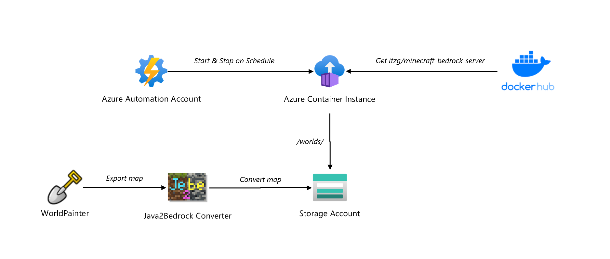

# azure-minecraft-bedrock

## Build Status

| GitHub Action | Status |
| ----------- | ----------- |
| Build | [](https://github.com/pascalvanderheiden/azure-minecraft-bedrock/actions/workflows/build.yml) |
| Release | [](https://github.com/pascalvanderheiden/azure-minecraft-bedrock/actions/workflows/release.yml) |

## About


This repository deploys [itzg/minecraft-bedrock-server](https://hub.docker.com/r/itzg/minecraft-bedrock-server) to Azure Container Instance. You can deploy it manually or by GitHub Actions, already prepared for you in this repo. The Build pipeline will deploy the infrastructure in Azure and a release pipeline is used for deploying custom worlds to this server. The custom worlds are created in [WorldPainter](https://www.worldpainter.net/).

My colleague created this [repo](https://github.com/geekzter/azure-minecraft-docker) for deploying Minecraft Java servers to Azure Container Instance. I really like the idea of a docker image that can be used to deploy a minecraft server, and that it can be deployment via an automated process. So I tried it out, but the image he used is for the Minecraft Java edition only. And my son, and his friends only play on consoles. 

I than stumbled upon this [Minecraft Bedrock Server Build](https://www.minecraft.net/en-us/download/server/bedrock) which is still in Alpha, but will do the job. I discovered that the image is also available on Docker Hub. I deployed this manually, and it worked with my Windows version of Minecraft, but not on my XBox One or a PS4. 

Than I found this App for [iOS](https://apps.apple.com/us/app/bedrocktogether/id1534593376) and [Android](https://play.google.com/store/apps/details?id=pl.extollite.bedrocktogetherapp&hl=en_US&gl=US), which basically acts as a local proxy to the Bedrock Server. The server will than popup in your Friends List as a local LAN server. And this works!

My son happy, his friends happy and I'm happy. But it doesn't stop there. My son learned about [WorldPainter](https://www.worldpainter.net/), an application where you can create custom worlds. How cool would it be to create a custom world for our Bedrock Server? I thought so, but it didn't work. Java Only.

But, than I found this Windows Store App [je2be](https://apps.microsoft.com/store/detail/je2be/9PC9MFX9QCXS?hl=en-ca&gl=CA). It can convert Java exported worlds to Bedrock. And this really works!

I hope you enjoy this project as much as I do.

## Architecture



Next to the Azure Container Instance for the Bedrock Server and the Azure Storage Account for the File Share, I've also added two Azure Automation Runbooks, for starting and stopping the Bedrock Server on a schedule for cost saving and limiting game time. For releasing new worlds to the Bedrock Server I use GitHub Actions in this repo for automated deployment.

## Prerequisites

* Install [Visual Studio Code](https://code.visualstudio.com/download)
* Install [WorldPainter](https://www.worldpainter.net/), is optional, only if you want to create custom worlds.
* Install [je2be](https://apps.microsoft.com/store/detail/je2be/9PC9MFX9QCXS?hl=en-ca&gl=CA), also optional.
* Install Bedrock Together for [iOS](https://apps.apple.com/us/app/bedrocktogether/id1534593376) and [Android](https://play.google.com/store/apps/details?id=pl.extollite.bedrocktogetherapp&hl=en_US&gl=US)
* Install Chocolatey (package manager), needed for manual deployment

```ps1
Set-ExecutionPolicy Bypass -Scope Process -Force; [System.Net.ServicePointManager]::SecurityProtocol = [System.Net.ServicePointManager]::SecurityProtocol -bor 3072; iex ((New-Object System.Net.WebClient).DownloadString('https://community.chocolatey.org/install.ps1'))
```

* Install Bicep CLI, needed for manual deployment

```ps1
choco install bicep
```

* Install Az Module in PowerShell, needed for manual deployment

```ps1
Install-Module -Name Az -AllowClobber -Scope CurrentUser
```

## Deploy Manually

* Git Clone the repository

```ps1
git clone https://github.com/pascalvanderheiden/azure-minecraft-bedrock.git
```

* Deploy it all by one script

I've included all the steps in 1 Powershell script. This will create all the needed resources. Keep in mind that this will take a while to deploy.

I've used these variables:

```ps1
$subscriptionId = "<subscription_id>"
$namePrefix = "<project_prefix>"
# Set start and end time for Minecraft Server (ex. after school only)
$timeZone = "Europe/Amsterdam"
$startTime = "15:00"
$endTime = "22:00"
# Set Minecraft Bedrock Environement variables (you can check the properties on Docker Hub)
$gameMode = "survival"
$gameDifficulty = "normal"
$gameAllowCheats = "true"
$deploymentNameBuild = "deployMinecraftBedrock"
$folderNameWorld = "Bedrock level" 
```

```ps1
.\deploy\manual-deploy.ps1 -subscriptionId $subscriptionId -namePrefix $namePrefix -timeZone $timeZone -startTime $startTime -endTime $endTime -gameMode $gameMode -gameDifficulty $gameDifficulty -gameAllowCheats $gameAllowCheats -deploymentNameBuild $deploymentNameBuild -folderNameWorld $folderNameWorld
```

## Deploy with Github Actions

* Fork this repository

* Generate a Service Principal

```ps1
az ad sp create-for-rbac -n <name_sp> --role Contributor --sdk-auth
```

Copy the json output of this command.

* Update GitHub Secrets for customizing your deployment

In the repository go to 'Settings', on the left 'Secrets', 'Actions'.
And pass the json output in the command used above into the secret 'AZURE_CREDENTIALS'.

The following secrets need to be created:

* AZURE_CREDENTIALS
* AZURE_SUBSCRIPTION_ID
* LOCATION
* PREFIX

### Trigger
You can trigger the Build Pipeline from the Actions tab in GitHub. The Release Pipeline is automatically triggered when a updated is made to the release/worlds folder.